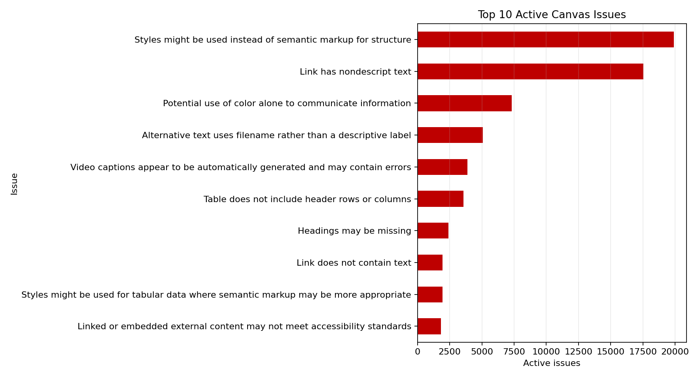
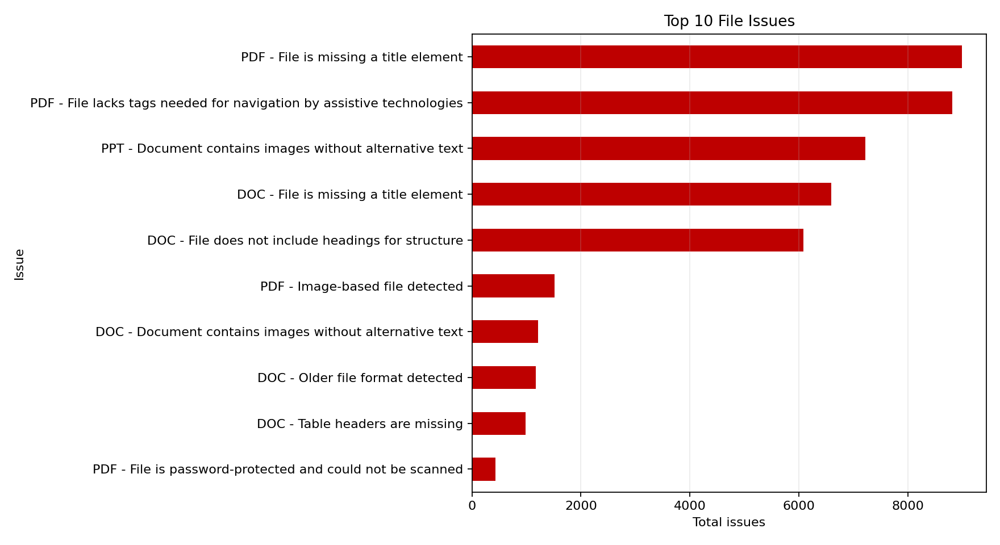
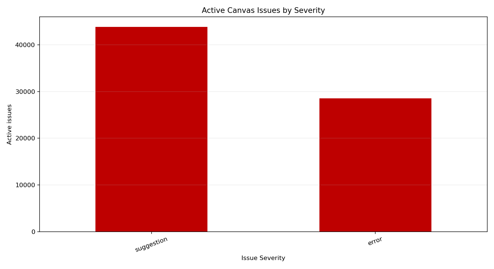
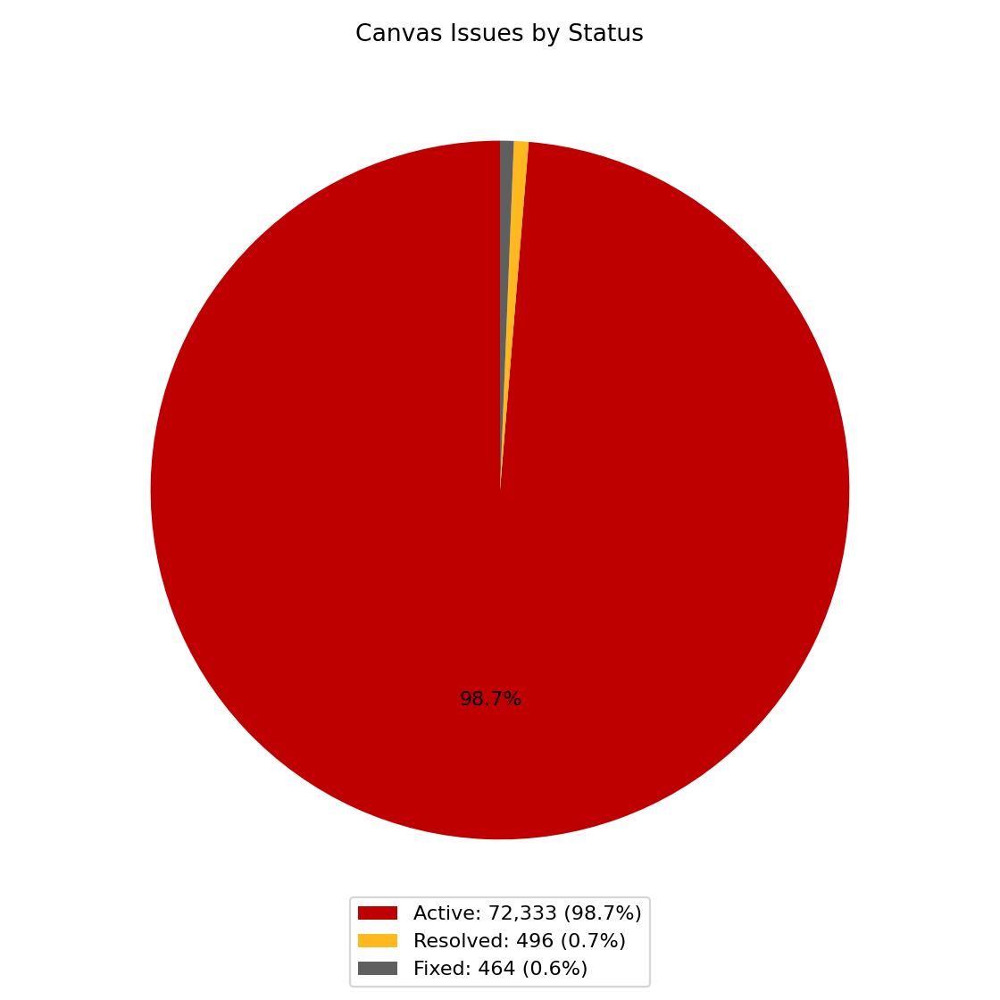
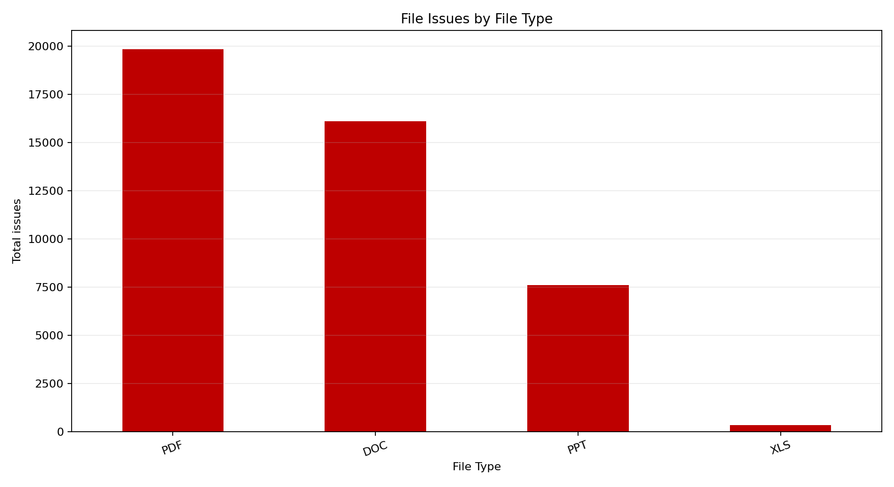
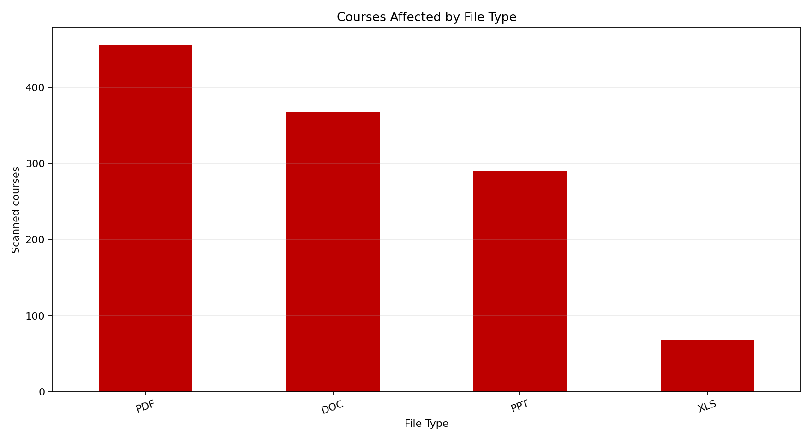

# Project Fantasia roadmap

This roadmap turns the May 22, 2026 UDOIT export into an implementation order for Wand, Magic, and Sorcerer. Counts describe findings, not unique pages or estimated engineering effort, so they are priority signals rather than delivery promises.

> [!NOTE]
> Status legend: **✅ Shipped** is released; **🧪 In testing** is implemented and awaiting field validation; **🚧 In progress** is actively being built; **📋 Planned** is ordered but not started; **⏸️ Deferred** is intentionally outside the current phase.

## What the data says

- Canvas has **72,333 active findings** out of 73,293 observed statuses (**98.7% active**): 43,815 suggestions and 28,518 errors.
- Wand's current five remediation types represent **53,669 active findings**, or **74.2%** of the active Canvas backlog.
- The two largest Canvas findings alone—styled headings and nondescript links—represent **37,416 findings**, or **51.7%** of the active backlog.
- Files account for **43,875 findings**: PDF 19,822 (45.2%), DOC 16,101 (36.7%), PPT 7,603 (17.3%), and XLS 349 (0.8%).
- PDF title and tagging problems account for **17,809 findings**, or **89.8%** of PDF findings, across 451–456 courses.
- DOC title and heading problems account for **12,683 findings**, or **78.8%** of DOC findings, across 346–368 courses.
- Missing PowerPoint image alternative text accounts for **7,225 findings**, or **95.0%** of PPT findings, across 290 courses.

| Canvas priorities | File priorities |
| --- | --- |
|  |  |

View the remaining source charts

## Product boundaries

| Application | Best use | Current boundary |
| --- | --- | --- |
| **Wand** | Interactive, context-aware remediation while a reviewer works in UDOIT and Canvas | Canvas content and UDOIT workflows; file repair stays out of the extension |
| **Magic** | Local, reviewer-controlled processing where files or sensitive exports remain on the user's computer | Single-user jobs with previews, confirmations, and recoverable output |
| **Sorcerer** | Centrally managed bulk processing, queues, reporting, retries, and governance | Build only after Magic proves safe repair operations and review rules |

## Wand roadmap

| Priority | Capability | Evidence | Status | Exit criteria |
| :-: | --- | --- | :-: | --- |
| P0 | Styled-heading remediation | 19,889 findings / 474 courses | **🧪 In testing** | Correct Canvas item opens, target is selected, save/next remains synchronized |
| P0 | Nondescript-link cleanup | 17,527 / 495 | **🧪 In testing** | Safe suggestion is applied without auto-saving; unsupported text fails visibly |
| P0 | Color-only identification and optional bold cue | 7,308 / 234 | **🧪 In testing** | Correct content is selected; reviewer explicitly applies and saves any cue |
| P0 | Filename-based image alternative-text cleanup | 5,070 / 298 | **🧪 In testing** | Filename cleanup is suggested with visible confirmation and no automatic save |
| P0 | Automatically generated caption review | 3,875 / 245 | **🧪 In testing** | Correct media opens; platform and UDOIT recheck actions work or fail visibly |
| P0 | Cross-workflow hardening | Protects all current modes | **🚧 In progress** | Test-course regression passes; loading, timeout, toast, logging, reload, and next-issue behavior are reliable |
| P1 | Table header rows and columns | 3,567 / 276 | **📋 Planned** | Identify the table and provide safe header guidance or an explicit reviewed edit |
| P1 | Missing headings and skipped heading levels | 4,035 combined; up to 377 courses | **📋 Planned** | Identify the location and guide a valid heading hierarchy without guessing structure |
| P1 | Links with no text | 1,954 / 304 | **📋 Planned** | Identify the link and require descriptive text before resolution |
| P2 | Insufficient color contrast | 1,562 / 127 | **📋 Planned** | Report measured colors and suggest a compliant branded alternative for review |
| P2 | Missing video captions | 1,044 / 164 | **📋 Planned** | Open the correct media workflow and verify refreshed UDOIT status |
| P2 | Styled tabular data and external-content review | 3,760 combined | **📋 Planned** | Prioritize reliable identification and guidance; do not claim third-party content was repaired |
| — | PDF, DOC, PPT, and XLS repair inside Wand | Covered by Magic/Sorcerer | **⏸️ Deferred** | Remains outside the extension |

## Magic roadmap

| Priority | Capability | Evidence | Status | Exit criteria |
| :-: | --- | --- | :-: | --- |
| P0 | MHA Competencies workbook workflow | Existing operational need | **✅ Shipped** | Preserve current workflow while accessibility jobs are added independently |
| P1 | Shared file-job framework | Foundation for 43,875 findings | **📋 Planned** | Dry run, backup/output separation, per-file result, cancellation, and summary report |
| P1 | PDF title repair | 8,994 / 456 | **📋 Planned** | Detect missing title, propose metadata, preserve the original, and verify output |
| P1 | PDF tagging/navigation workflow | 8,815 / 451 | **📋 Planned** | Run approved tagging engine, surface failures, and require review before replacement |
| P1 | DOC title and heading repair | 12,683 combined; up to 368 courses | **📋 Planned** | Apply reviewed metadata/heading changes with a before-and-after report |
| P1 | PPT image alternative-text review | 7,225 / 290 | **📋 Planned** | Inventory images, collect or generate reviewer-approved descriptions, and verify saved output |
| P2 | Image-based PDF OCR and review | 1,518 / 196 | **📋 Planned** | Create searchable output and flag low-confidence pages for human review |
| P2 | DOC image alt text and table headers | 2,196 combined | **📋 Planned** | Provide item-by-item review and structural verification |
| P2 | Legacy DOC/PPT/XLS conversion | 1,838 combined | **📋 Planned** | Convert to modern formats without overwriting originals and report compatibility failures |
| — | Password-protected files | 435 / 92 | **⏸️ Deferred** | Report and route to the owner; never bypass protection |

## Sorcerer roadmap

| Priority | Capability | Evidence | Status | Exit criteria |
| :-: | --- | --- | :-: | --- |
| P0 | Architecture and governance | Bulk work may affect hundreds of courses | **📋 Planned** | Define authentication, authorization, storage lifetime, audit logs, rollback, and approval gates |
| P1 | Job queue and worker contract | Needed before any safe batch remediation | **📋 Planned** | Retryable, idempotent jobs with progress, cancellation, timeouts, and structured errors |
| P1 | Reviewer dashboard | 43,875 file findings need triage | **📋 Planned** | Filter by course/type/severity; preview proposed changes; approve or reject batches |
| P1 | PDF title/tagging at scale | 17,809 findings across 451–456 courses | **📋 Planned** | Reuse proven Magic operations with backups, sampled QA, and downloadable reports |
| P2 | DOC and PPT batch remediation | 19,908 combined title/heading/PPT-alt findings | **📋 Planned** | Reuse proven Magic operations with per-file review exceptions and rollback |
| P2 | Canvas handoff and status reconciliation | 98.7% of observed Canvas statuses remain active | **📋 Planned** | Track attempted, verified, rejected, and failed outcomes without auto-resolving unverified issues |
| P3 | Scheduling, analytics, and prioritization | Sustained institutional operation | **📋 Planned** | Scheduled runs, trend reporting, course-owner routing, and impact metrics |

## Delivery order

1. Finish Wand P0 field validation on Rafael's Test Course and release the five current remediations.
2. Build Magic's shared safe file-job framework, then implement PDF title/tagging, DOC title/headings, and PPT alternative-text review in that order.
3. Add Wand P1 Canvas remediations in order of reach and safe automation potential.
4. Start Sorcerer only after at least one Magic file remediation has reliable validation, reporting, and rollback behavior.
5. Re-run the analytics export after each release cycle and revise priorities when issue counts or completion rates materially change.
